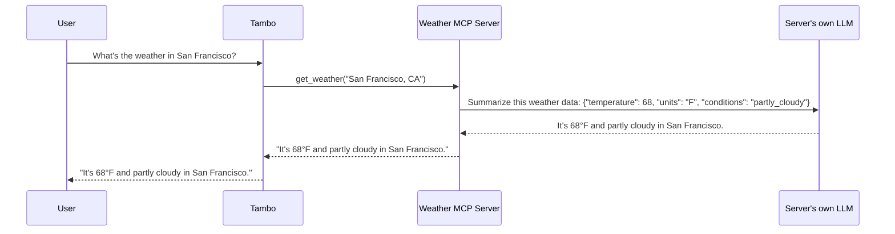
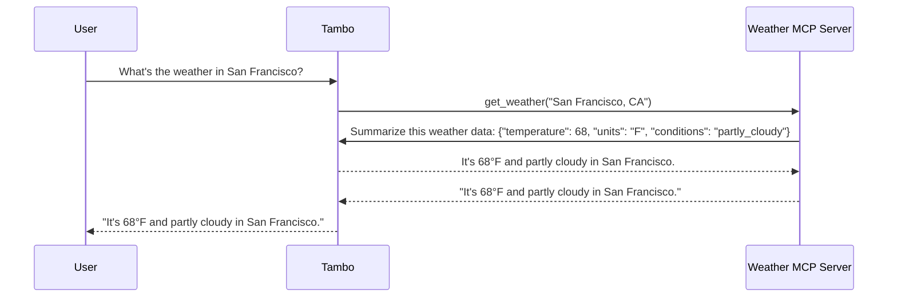

<ImageZoom>
  
</ImageZoom>

[Tambo](https://tambo.co) helps developers build LLM-based AI web apps by discovering, understanding, and packaging up emerging UX patterns so you can integrate them without building from scratch.

[MCP (Model Context Protocol)](https://modelcontextprotocol.io/docs/getting-started/intro) has become the standard for how AI apps connect to external services and tools to extend their abilities. While MCP defines the technical protocol, it's up to developers to figure out how to present these capabilities to users in their app's UI.

At Tambo, we're building comprehensive MCP support so your app becomes "MCP-enabled" automatically. Today we're announcing support for [MCP Sampling](https://modelcontextprotocol.io/docs/learn/client-concepts#sampling), following our previous release of [MCP tools](https://modelcontextprotocol.io/docs/learn/server-concepts#tools) support.

## What is MCP Sampling?

[MCP Sampling](https://modelcontextprotocol.io/docs/learn/client-concepts#sampling) is the ability of an MCP server to use the client’s LLM. For example, when a user asks "What's the weather like today?", a Weather MCP server will fetch the raw temperature and forecast data. With sampling, it can then use _the app's LLM_ to summarize the data before showing it to the user. This is especially useful if you are building your own MCP server for your app to use. With sampling, you don't have to worry about setting up an LLM connection.

Without MCP sampling, the server would need its own AI setup.

With MCP Sampling through Tambo, the server uses Tambo's AI setup.

## The UX of Sampling in Tambo

Tambo apps using our pre-built `Message` component display an expandable dropdown when Tambo decides to use a tool. This dropdown shows details of the tool call to the user. We consider sampling requests as "sub-conversations" between the MCP tool and Tambo, so Tambo represents them as expandable lists of messages within the tool's information dropdown.

The following example uses an `emojify_via_llm` MCP tool which uses Sampling to turn a string into emojis. Within the dropdown you can see the messages the tool sent to Tambo and the responses it received.

<ImageZoom>
  
</ImageZoom>

The title of the dropdown defaults to “finished additional work” but is customizable. To customize this, update the `titleText` prop passed into the `SamplingSubThread` component within `message.tsx`.

<ImageZoom>
  
</ImageZoom>

## How to customize Tambo's Sampling UI

Behind the scenes, Tambo adds messages sent and returned through sampling requests to the user's conversation thread. The sampling messages have a `parentMessageId` field pointing to the assistant message tool call that triggered the sampling request. This is what distinguishes them as "sub messages" of a normal conversation message. Note that Tambo passes a `_meta` field containing the `parentMessageId` to MCP tools and expects sampling requests to pass that along to Tambo.

To build your own custom sampling UI, use Tambo’s [React SDK](https://github.com/tambo-ai/tambo) to get the list of messages for the current thread, and use the `parentMessageId` field on the messages to group and show sampling messages in any way you prefer.

<ImageZoom>
  
</ImageZoom>

## How to enable MCP Sampling in your app using Tambo

If you already have an app with Tambo running, you’ll need to:

- Upgrade your `tambo-ai/react` dependency to at least version `0.57.0` using `npm install @tambo-ai/react@0.57.0`
- Upgrade your installed Tambo `Message` component using `npx tambo@latest upgrade message`

If you haven’t integrated Tambo into your web app yet, new installations will automatically contain MCP Sampling functionality and UI. To get started, check out our [documentation](https://docs.tambo.co/getting-started/quickstart).

## Up next for MCP Sampling support

- Allow client-side MCP servers to make sampling requests.
- Enable user confirmation or rejection of sampling requests.
